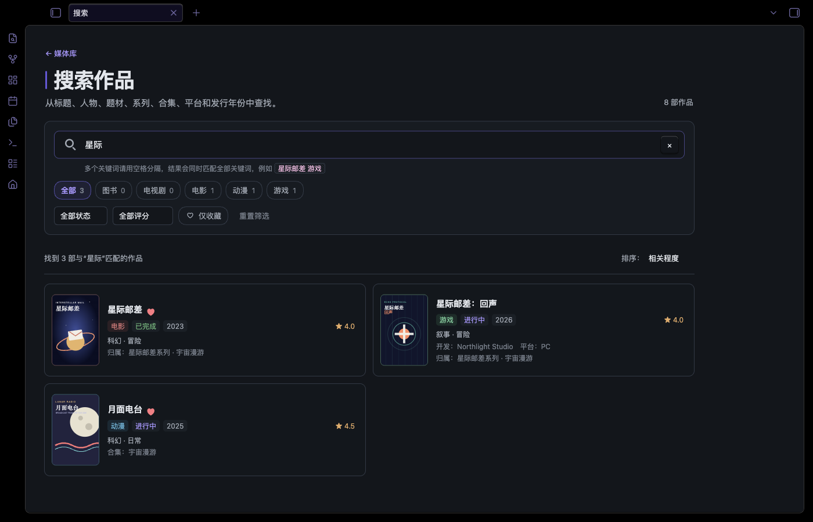
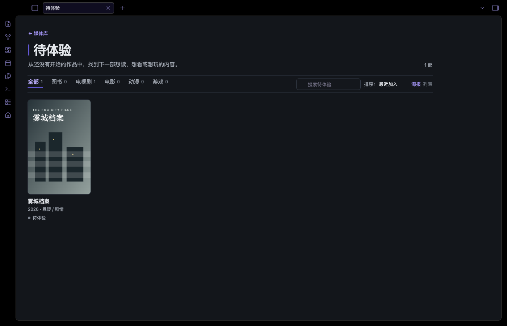
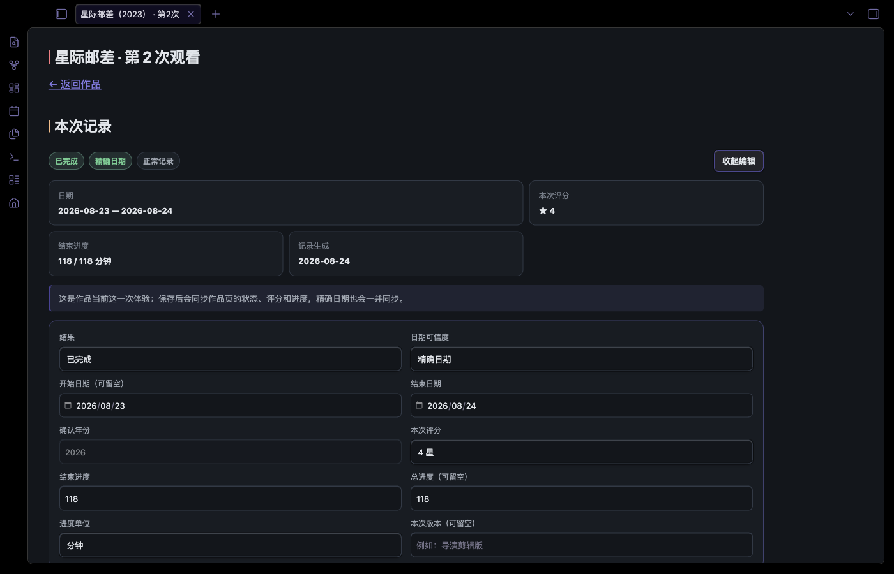
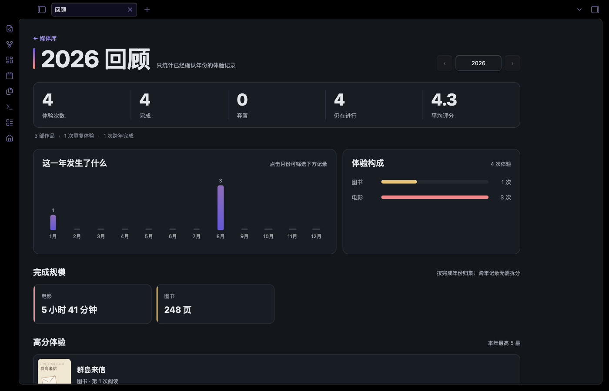
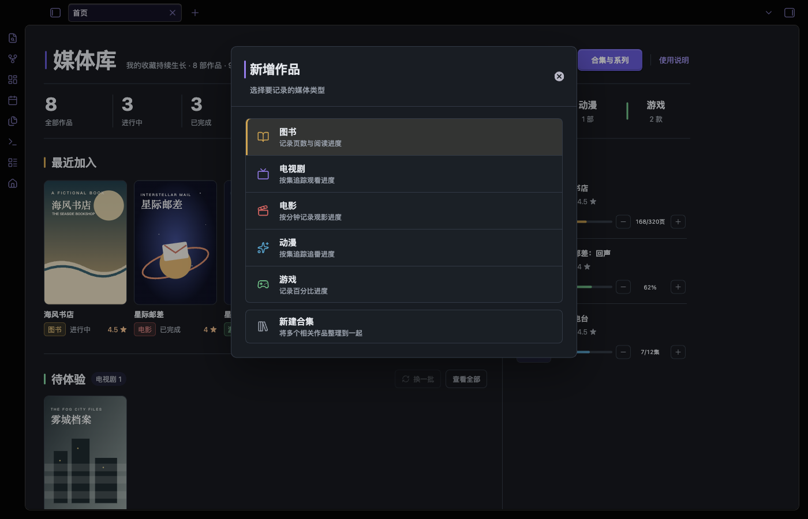
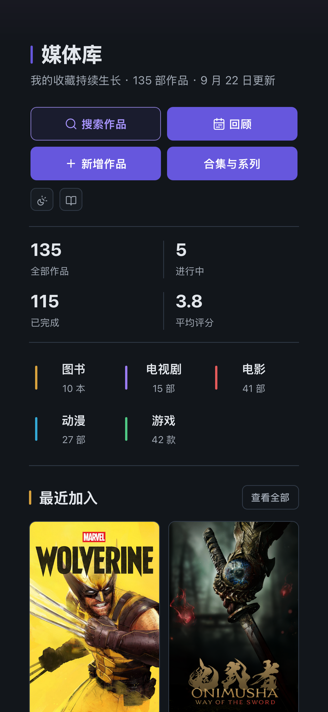

# Obsidian 媒体库模板

一套可以直接作为 Obsidian 仓库打开的个人媒体管理模板，用统一的数据结构整理图书、电视剧、电影、动漫、游戏、综艺和纪录片。它包含首页仪表盘、全库搜索、待体验候选、独立体验记录、年度回顾、系列/合集关系，以及手动和豆瓣两种录入方式。

仓库只包含虚构示例，不包含作者本人的阅读、观影、游戏记录、账号、Cookie 或本地工作区状态。


## 能做什么

- 七类作品统一管理；默认启用图书、电视剧、电影、动漫和游戏，综艺与纪录片可按需启用，任何类型都可停用且不会删除旧作品。
- 按待体验、进行中、已完成、高分等视图浏览。
- 全库搜索可同时匹配标题、人物、题材、系列、合集、平台和年份，并继续按类型、状态、评分与收藏筛选。
- 首页在同一屏展示最近加入、待体验和正在进行；待体验支持换一批、查看全部与直接开始。
- 支持图书页数、剧集集数、电影观看时长和游戏百分比进度。
- 首页和作品详情页都可直接增减或精确输入进度；详情页进度满后可确认标记完成，状态改为已完成时也会自动补满已知总量，已完成进度被减少时则恢复为进行中。
- 支持按媒体类型记录开始与结束日期；详情页可手动修改，状态和首页进度操作也会在日期为空时自动记录当天。
- 0.5–5 分半星评分和收藏状态。
- 每次完成或弃置会生成独立体验记录；当前次数与作品双向同步，开始下一次体验后旧记录冻结。
- 年度回顾按结束年份统计体验，包含月份时间线、完成规模、高分体验与可筛选的完整记录。
- 系列、主题合集与双向相关作品三种关系。
- 合集成员区分作品直接加入与系列继承，系列归属变化时自动更新继承结果；可在搜索弹窗中批量管理直接作品。
- 本地封面缓存与可拖动调整显示区域的作品横幅。
- QuickAdd 提供带分类图标的新增界面、手动录入表单和可选 Douban 导入；综艺与纪录片会根据豆瓣条目自动选择时长或集数记录。
- 桌面端与移动端响应式布局。
- 媒体库页面支持日间、夜间和跟随 Obsidian 三种外观模式，选择按仓库保存。

## 界面预览

### 浏览与作品详情

| 分类视图 | 作品详情 |
| --- | --- |
|  |  |

### 搜索与待体验

| 全库搜索 | 全部待体验 |
| --- | --- |
|  |  |

### 体验记录与年度回顾

| 单次体验记录 | 年度回顾 |
| --- | --- |
|  |  |

### 合集与系列


### 新增作品



### 移动端

<p align="center">
  
</p>

除移动端示例来自个人库的实际数据外，其余图片均由 Obsidian 运行本仓库中的虚构示例数据后截取，不是设计稿。

## 环境要求

- Obsidian 1.13.1 或更高版本；本模板在 1.13.7 测试。
- 桌面端用于首次安装插件；配置完成后可在移动端使用。
- 必需插件：Dataview、Meta Bind、QuickAdd。
- 推荐插件：Homepage。
- 可选插件：Douban、Style Settings。
- 推荐主题：Border；其他主题也能运行，视觉效果会不同。

## 快速开始

1. 下载仓库 ZIP 并解压，或克隆仓库。
2. 在 Obsidian 中选择「打开本地仓库」，选中解压后的根目录。
3. 打开「设置 → 第三方插件」，关闭安全模式。
4. 从 Obsidian 插件市场安装并启用 Dataview、Meta Bind、QuickAdd；建议再安装 Homepage。
5. 在 Dataview 设置中打开 `Enable JavaScript Queries`。
6. 打开「设置 → 外观」，启用 `media-library` CSS 片段。想复现截图样式，再安装 Border 主题和 Style Settings。
7. 打开 `媒体库/首页.md`。确认无误后按「使用说明」删除虚构示例。

插件的配置文件已随仓库提供；第三方插件本体没有打包进来，避免重复分发代码、锁死旧版本和把来路不明的二进制文件塞给用户。安装插件后，Obsidian 会读取对应目录中的设置。

## 从旧版本升级

已经在使用旧版本时，不需要重建仓库或重新导入作品。请先备份整个 Obsidian 仓库，并等待同步完成；再将新版本下载到单独目录，不要把 ZIP 直接解压到正在使用的仓库上。

### 1. 迁移旧目录

本次整理调整了附件、导航和数据表的路径。已有库请先按 [目录迁移说明](docs/目录迁移说明.md) 移动自己的文件并更新引用，再复制功能文件。不要只覆盖首页，否则入口和旧附件路径可能失效。

### 2. 复制功能文件

如果没有修改过下列文件，可以从新版本直接复制并覆盖：

- `.obsidian/snippets/media-library.css`
- `媒体库/首页.md`
- `媒体库/导航/` 下的分类页、全部作品、待体验、搜索、回顾与合集索引
- `媒体库/说明/使用说明.md`
- `媒体库/说明/数据字典.md`
- `媒体库/视图/作品头图/view.js`
- `媒体库/视图/主题/view.js`
- `媒体库/视图/主题/豆瓣分类导入.js`
- `媒体库/视图/体验记录/view.js`
- `媒体库/视图/搜索/view.js`
- `媒体库/视图/回顾/view.js`
- `媒体库/视图/类别页/view.js`
- `媒体库/视图/作品关系/view.js`
- `媒体库/视图/合集页/view.js`
- `媒体库/视图/合集关系索引/view.js`
- `媒体库/视图/数据表/` 下的 `.base` 管理视图
- `媒体库/模板/手动/` 下的 7 个作品录入模板和 `合集.md`
- `媒体库/模板/豆瓣/` 下的 4 个导入模板

如果曾经改过首页、视图、模板或 CSS，请对比合并，否则覆盖会丢失个人定制。

1.4.0 新增作品类型管理、综艺和纪录片，并使用 `media_format` 分开“作品属于哪一类”与“进度按什么记录”。升级时请同步 `媒体库/配置/作品类型.json`、综艺与纪录片导航页、新的手动模板、豆瓣分类导入脚本、QuickAdd 配置和 `.obsidian/types.json`。旧作品缺少 `media_format` 时会自动推断，不需要批量改写。

1.3.0 新增了体验次数、历史记录和年度回顾。覆盖功能文件后，请同步 `.obsidian/types.json` 中的新字段类型。旧作品缺少 `experience_index` 时会按第一次体验处理；首次补建历史时会标记为 `migrated`，不会未经确认就进入年度回顾。打开生成的体验记录，选择“精确日期”或“只确认年份”后才会纳入正式统计。

1.2.2 统一了合集规则。覆盖功能文件后，请按 [合集关系迁移说明](docs/合集关系迁移说明.md) 检查旧作品中同时存在于作品与所属系列的重复合集关系。模板不会自动删除这些关系，因为其中可能包含用户有意保留的直接归属。

从 1.2.2 升级到 1.2.3 不需要迁移数据。只需覆盖 `.obsidian/snippets/media-library.css`、`媒体库/视图/作品头图/view.js`、`媒体库/视图/作品关系/view.js` 和 `媒体库/视图/合集页/view.js`，然后重新加载 Obsidian。1.2.3 会在原有字段上补充保存失败恢复、满进度确认完成和集中管理作品功能。

### 3. 处理 Obsidian 和 QuickAdd 配置

- 没有自定义属性类型时，可覆盖 `.obsidian/types.json`。已有自定义时，请合并 `last_activity_at`、`experience_index`、`work`、`result`、`record_origin`、`date_certainty`、`year_verified`、`verified_year`、`ended_at`、`progress_value`、`progress_total`、`progress_unit`、`experience_rating`、`edition` 和 `played_on` 的类型。
- 没有自定义 QuickAdd 时，可覆盖 `.obsidian/plugins/quickadd/data.json`，以获得新的「新增作品」界面。如果添加过自己的 QuickAdd 命令，请先保留原文件，再对比合并配置，不要直接覆盖。
- 本次升级没有新增必需插件；建议将 Dataview、Meta Bind 和 QuickAdd 更新至本文测试版本或更高的兼容版本。
- 使用豆瓣导入时，将插件的附件保存目录设为 `媒体库/作品/封面`，保留自己的登录配置。

### 4. 保留用户数据

不要从新版本复制或覆盖 `媒体库/作品/` 和 `媒体库/合集/`，其中包含自己的笔记、封面和横幅；新版本中的虚构示例也不需要复制。

旧作品没有 `started_at`、`finished_at` 或 `experience_index` 也能正常使用，升级不会仅因打开页面就批量猜测或改写历史日期：

- 可在作品详情页手动补填真实日期。
- 日期为空时，首页首次调整进度会记录当天为开始日期；在首页点击完成会补记缺失的开始和结束日期。
- 在作品详情页将状态改为进行中，会补记开始日期；改为已完成，会补记结束日期。
- 已完成的旧作品不会自动生成一个可能错误的日期，可以保留为空或手动补录。

### 5. 重载并检查

覆盖或合并完成后，在 Obsidian 命令面板执行「重新加载应用」，并确认：

- `media-library` CSS 片段仍已启用。
- 首页按钮显示为「新增作品」，可正常打开 QuickAdd。
- 作品详情页可以显示并修改开始/结束日期。
- 作品详情页达到满进度时会显示“标记完成”，确认后状态和完成日期正确更新。
- 作品评分、进度与关系修改成功后，笔记属性与页面显示一致。
- 当前体验完成或弃置后会生成记录，作品与当前次数的评分、进度和精确日期可双向同步。
- 回顾页只统计已确认年份的记录，跨年体验只归入结束年份。
- 合集页“管理作品”可搜索并批量移出直接作品，系列继承项保持锁定并标明来源。
- 手机端的新增菜单、表单和合集索引可正常切换。

## 插件清单

| 插件 | 作用 | 级别 | 测试版本 |
| --- | --- | --- | --- |
| [Dataview](https://obsidian.md/plugins?id=dataview) | 首页、分类、详情与关系视图的数据查询 | 必需 | 0.5.68 |
| [Meta Bind](https://obsidian.md/plugins?id=obsidian-meta-bind-plugin) | 状态、评分、收藏、进度与关系控件 | 必需 | 1.5.1 |
| [QuickAdd](https://obsidian.md/plugins?id=quickadd) | 「新增作品」和「新建合集」菜单 | 必需 | 2.22.0 |
| [Homepage](https://obsidian.md/plugins?id=homepage) | 启动时自动打开媒体库首页 | 推荐 | 4.4.4 |
| [Douban](https://obsidian.md/plugins?id=obsidian-douban-plugin) | 从豆瓣导入公开条目信息 | 可选 | 2.5.0 |
| [Style Settings](https://obsidian.md/plugins?id=obsidian-style-settings) | 调整 Border 主题细节 | 可选 | 1.0.9 |

主题：[Border](https://obsidian.md/themes?search=Border)，测试版本 1.13.7。更完整的第三方说明见 [THIRD_PARTY.md](THIRD_PARTY.md)。

## 目录结构

```text
.
├── .obsidian/
│   ├── snippets/media-library.css
│   ├── plugins/*/data.json       # 仅设置，不含插件本体
│   ├── appearance.json
│   └── types.json
├── docs/images/                  # README 实机截图
└── 媒体库/
    ├── 首页.md
    ├── 导航/                     # 分类、搜索、回顾、待体验与合集索引
    ├── 说明/使用说明.md
    ├── 作品/                     # 虚构示例；用户内容统一放这里
    │   ├── 封面/                 # 作品竖版封面
    │   └── 横幅/                 # 作品横版背景
    ├── 合集/                     # 系列与主题合集
    │   ├── 封面/                 # 合集、系列竖版封面
    │   └── 横幅/                 # 合集、系列横版背景
    ├── 模板/                     # 手动与豆瓣录入模板
    ├── 记录/                     # 每一次已结束体验的历史快照
    └── 视图/                     # DataviewJS 页面组件
        └── 数据表/               # 全部作品、待体验与内置分类视图
```

## 使用方式

日常入口是 `媒体库/首页.md`。点击「新增作品」后选择类型，再选择手动新增或豆瓣导入。作品文件统一放在 `媒体库/作品/`，不要按类型移动；页面分类由 `media_type` 属性决定。

系列、合集、双向相关作品的区别，以及字段、封面、备份和故障排查，请看 [媒体库内置使用说明](媒体库/说明/使用说明.md)。

## 图片素材规格

模板会在不同宽度的卡片和移动端布局中重复使用同一张图片。比例比绝对尺寸更重要：尺寸可以更大，但比例不一致时会被居中裁切。

| 用途 | 建议比例 | 推荐尺寸 | 最低建议 | 保存目录 |
| --- | --- | --- | --- | --- |
| 作品封面 | 2:3 竖版 | 1000 × 1500 px | 600 × 900 px | `媒体库/作品/封面/` |
| 作品横幅 | 16:9 横版 | 1920 × 1080 px | 1280 × 720 px | `媒体库/作品/横幅/` |
| 合集或系列封面 | 2:3 竖版 | 1000 × 1500 px | 600 × 900 px | `媒体库/合集/封面/` |
| 合集或系列横幅 | 16:9 横版 | 1920 × 1080 px | 1280 × 720 px | `媒体库/合集/横幅/` |

- 优先使用 WebP 或 JPG；需要透明背景时再使用 PNG。建议单张封面控制在 1 MB 内、横幅控制在 2 MB 内，避免仓库和同步空间迅速膨胀。
- 封面尽量直接准备成 2:3，避免人物、标题或游戏 Logo 被卡片裁掉。
- 横幅会随窗口宽度裁切。作品页选图后会继续显示预览，可直接拖动图片调整显示区域；也可随时点击「调整横幅」重新修改。
- 文件名建议与作品或合集名称一致。把图片放入对应目录后，可在作品/合集页面选择；也可以直接填写 `cover`、`backdrop` 属性。
- 没有单独横幅时，模板会自动使用封面生成模糊背景，因此横幅并不是必填项。

### 推荐素材来源

- 影视剧、电影和动漫：[The Movie Database（TMDB）](https://www.themoviedb.org/)——封面优先选择 Poster，横幅优先选择 Backdrop。
- 游戏：[SteamGridDB](https://www.steamgriddb.com/)——封面选择接近 2:3 的竖版 Grid；Hero 图片通常比 16:9 更宽，作为横幅使用前建议先裁切。

这些网站只是素材查找建议，并非本模板的依赖或合作方。图片版权通常属于原权利人；请遵守来源网站的条款，仅保存自己有权使用的素材。公开派生仓库时，不要把下载的海报、剧照或游戏美术一并提交。

## 隐私与安全

模板发布前做了白名单式整理：没有复制真实作品笔记、真实附件、工作区布局、回收站或插件登录态。尤其注意，Douban 等插件可能把完整 Cookie 或请求头写入 `data.json`；公开自己的派生仓库前，不要只靠肉眼扫文件名，请按 [SECURITY.md](SECURITY.md) 的命令和清单检查内容。

仓库内的 `media-library.css`、视图脚本、文档和 SVG 示例图属于本项目；Obsidian、Border 主题及各插件归各自作者所有，且未包含在本仓库中。

## 自定义

- 改颜色与间距：编辑 `.obsidian/snippets/media-library.css`。
- 改状态或分类：同时更新模板、Bases 视图、首页脚本和 CSS，避免只改一处。
- 改目录名：需要全局替换 `媒体库/` 路径，并同步更新 QuickAdd、Homepage 和 Douban 配置。
- 增加媒体类型：至少补充手动模板、分类页、`.base` 文件、首页 `typeMeta` 和相关 CSS。

## 贡献

欢迎提交问题与改进。请勿在 Issue、截图、测试夹具或 Pull Request 中附带真实 Cookie、Token、付费内容、个人媒体记录或无权再分发的封面。详见 [CONTRIBUTING.md](CONTRIBUTING.md)。

豆瓣分类导入的回归测试可用 Node.js 运行：`node --test tests/豆瓣分类导入.test.cjs`。

## 许可证

本项目原创代码、模板、文档与示例 SVG 使用 [MIT License](LICENSE)。第三方软件与服务不受该许可证覆盖。
