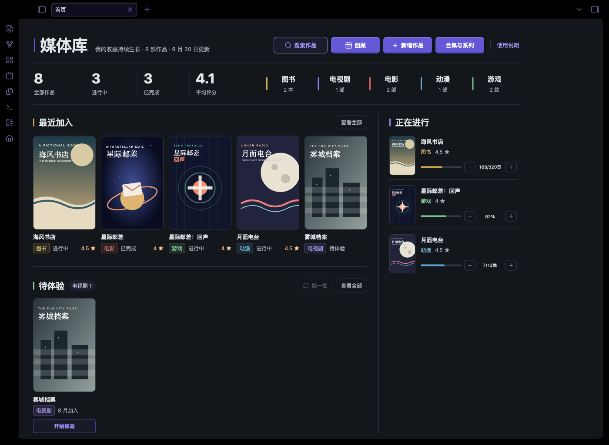
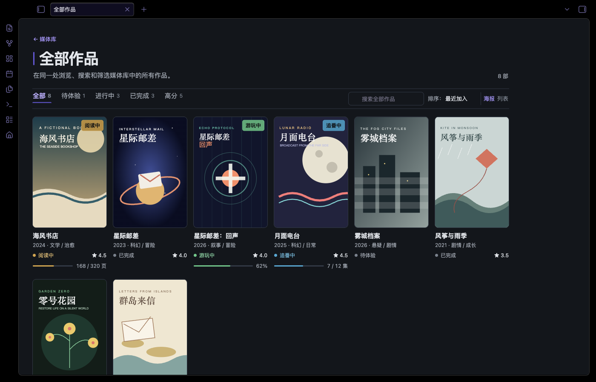
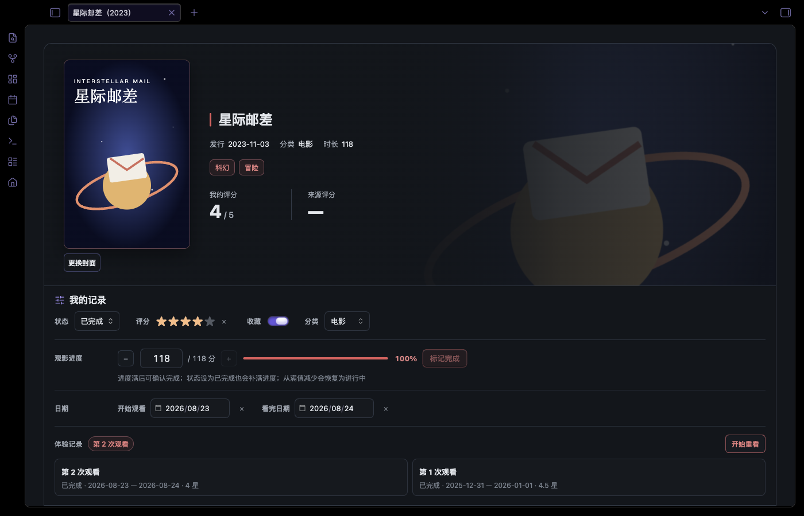
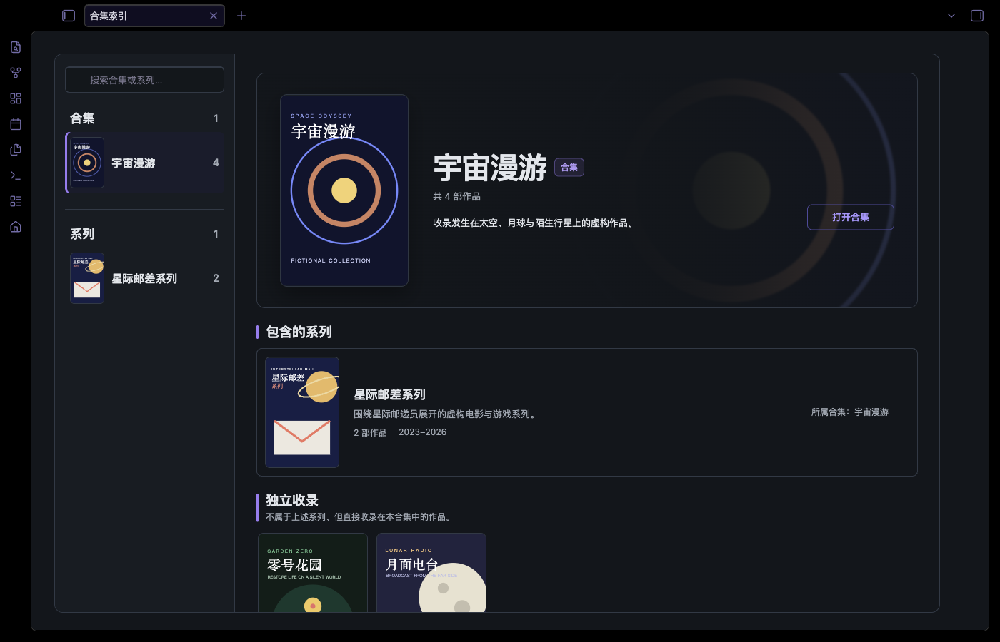

# Obsidian 媒体库模板

一套可以直接作为 Obsidian 仓库打开的个人媒体管理模板，用统一的数据结构整理图书、电视剧、电影、动漫和游戏。它包含首页仪表盘、分类卡片、进度与评分控件、系列/合集关系、双向相关作品，以及手动和豆瓣两种录入方式。

仓库只包含虚构示例，不包含作者本人的阅读、观影、游戏记录、账号、Cookie 或本地工作区状态。



## 能做什么

- 五类媒体统一管理，不需要维护五套文件夹。
- 按待体验、进行中、已完成、高分等视图浏览。
- 支持图书页数、剧集集数、电影观看时长和游戏百分比进度。
- 首页和作品详情页都可直接增减或精确输入进度；状态改为已完成时自动补满已知总量，已完成进度被减少时则恢复为进行中。
- 0.5–5 分半星评分和收藏状态。
- 系列、主题合集与双向相关作品三种关系。
- 本地封面缓存与可选 16:9 横幅。
- QuickAdd 一键创建，Douban 可选导入。
- 桌面端与移动端响应式布局。

| 分类视图 | 作品详情 |
| --- | --- |
|  |  |



以上图片均由 Obsidian 1.13.7 实际运行本仓库中的虚构示例数据后截取，不是设计稿。

## 环境要求

- Obsidian 1.13.1 或更高版本；本模板在 1.13.7 测试。
- 桌面端用于首次安装插件；配置完成后可在移动端使用。
- 必需插件：Dataview、Meta Bind、QuickAdd。
- 推荐插件：Homepage。
- 可选插件：Douban、Style Settings。
- 推荐主题：Border；其他主题也能运行，视觉效果会不同。

## 快速开始

1. 下载仓库 ZIP 并解压，或克隆仓库。
2. 在 Obsidian 中选择「打开本地仓库」，选中解压后的根目录。
3. 打开「设置 → 第三方插件」，关闭安全模式。
4. 从 Obsidian 插件市场安装并启用 Dataview、Meta Bind、QuickAdd；建议再安装 Homepage。
5. 在 Dataview 设置中打开 `Enable JavaScript Queries`。
6. 打开「设置 → 外观」，启用 `media-library` CSS 片段。想复现截图样式，再安装 Border 主题和 Style Settings。
7. 打开 `媒体库/首页.md`。确认无误后按「使用说明」删除虚构示例。

插件的配置文件已随仓库提供；第三方插件本体没有打包进来，避免重复分发代码、锁死旧版本和把来路不明的二进制文件塞给用户。安装插件后，Obsidian 会读取对应目录中的设置。

## 插件清单

| 插件 | 作用 | 级别 | 测试版本 |
| --- | --- | --- | --- |
| [Dataview](https://obsidian.md/plugins?id=dataview) | 首页、分类、详情与关系视图的数据查询 | 必需 | 0.5.68 |
| [Meta Bind](https://obsidian.md/plugins?id=obsidian-meta-bind-plugin) | 状态、评分、收藏、进度与关系控件 | 必需 | 1.5.1 |
| [QuickAdd](https://obsidian.md/plugins?id=quickadd) | 「新增作品」和「新建合集」菜单 | 必需 | 2.22.0 |
| [Homepage](https://obsidian.md/plugins?id=homepage) | 启动时自动打开媒体库首页 | 推荐 | 4.4.4 |
| [Douban](https://obsidian.md/plugins?id=obsidian-douban-plugin) | 从豆瓣导入公开条目信息 | 可选 | 2.5.0 |
| [Style Settings](https://obsidian.md/plugins?id=obsidian-style-settings) | 调整 Border 主题细节 | 可选 | 1.0.9 |

主题：[Border](https://obsidian.md/themes?search=Border)，测试版本 1.13.7。更完整的第三方说明见 [THIRD_PARTY.md](THIRD_PARTY.md)。

## 目录结构

```text
.
├── .obsidian/
│   ├── snippets/media-library.css
│   ├── plugins/*/data.json       # 仅设置，不含插件本体
│   ├── appearance.json
│   └── types.json
├── docs/images/                  # README 实机截图
└── 媒体库/
    ├── 首页.md
    ├── 使用说明.md
    ├── 图书.md / 电视剧.md / 电影.md / 动漫.md / 游戏.md
    ├── 作品/                     # 虚构示例；用户内容统一放这里
    ├── 合集/                     # 系列与主题合集
    │   ├── 封面/                 # 合集、系列竖版封面
    │   └── 横幅/                 # 合集、系列横版背景
    ├── 附件/                     # 作品封面与横幅
    ├── 模板/                     # 手动与豆瓣录入模板
    └── 视图/                     # DataviewJS 与 Bases 视图
```

## 使用方式

日常入口是 `媒体库/首页.md`。点击「新增作品」后选择类型，再选择手动新增或豆瓣导入。作品文件统一放在 `媒体库/作品/`，不要按类型移动；页面分类由 `media_type` 属性决定。

系列、合集、双向相关作品的区别，以及字段、封面、备份和故障排查，请看 [媒体库内置使用说明](媒体库/使用说明.md)。

## 图片素材规格

模板会在不同宽度的卡片和移动端布局中重复使用同一张图片。比例比绝对尺寸更重要：尺寸可以更大，但比例不一致时会被居中裁切。

| 用途 | 建议比例 | 推荐尺寸 | 最低建议 | 保存目录 |
| --- | --- | --- | --- | --- |
| 作品封面 | 2:3 竖版 | 1000 × 1500 px | 600 × 900 px | `媒体库/附件/封面/` |
| 作品横幅 | 16:9 横版 | 1920 × 1080 px | 1280 × 720 px | `媒体库/附件/横幅/` |
| 合集或系列封面 | 2:3 竖版 | 1000 × 1500 px | 600 × 900 px | `媒体库/合集/封面/` |
| 合集或系列横幅 | 16:9 横版 | 1920 × 1080 px | 1280 × 720 px | `媒体库/合集/横幅/` |

- 优先使用 WebP 或 JPG；需要透明背景时再使用 PNG。建议单张封面控制在 1 MB 内、横幅控制在 2 MB 内，避免仓库和同步空间迅速膨胀。
- 封面尽量直接准备成 2:3，避免人物、标题或游戏 Logo 被卡片裁掉。
- 横幅会随窗口宽度裁切，主体最好放在画面中部偏右，四周预留安全空间；左侧通常会叠加标题和信息渐变。
- 文件名建议与作品或合集名称一致。把图片放入对应目录后，可在作品/合集页面点击「选择封面」或「选择横幅」；也可以直接填写 `cover`、`backdrop` 属性。
- 没有单独横幅时，模板会自动使用封面生成模糊背景，因此横幅并不是必填项。

### 推荐素材来源

- 影视剧、电影和动漫：[The Movie Database（TMDB）](https://www.themoviedb.org/)——封面优先选择 Poster，横幅优先选择 Backdrop。
- 游戏：[SteamGridDB](https://www.steamgriddb.com/)——封面选择接近 2:3 的竖版 Grid；Hero 图片通常比 16:9 更宽，作为横幅使用前建议先裁切。

这些网站只是素材查找建议，并非本模板的依赖或合作方。图片版权通常属于原权利人；请遵守来源网站的条款，仅保存自己有权使用的素材。公开派生仓库时，不要把下载的海报、剧照或游戏美术一并提交。

## 隐私与安全

模板发布前做了白名单式整理：没有复制真实作品笔记、真实附件、工作区布局、回收站或插件登录态。尤其注意，Douban 等插件可能把完整 Cookie 或请求头写入 `data.json`；公开自己的派生仓库前，不要只靠肉眼扫文件名，请按 [SECURITY.md](SECURITY.md) 的命令和清单检查内容。

仓库内的 `media-library.css`、视图脚本、文档和 SVG 示例图属于本项目；Obsidian、Border 主题及各插件归各自作者所有，且未包含在本仓库中。

## 自定义

- 改颜色与间距：编辑 `.obsidian/snippets/media-library.css`。
- 改状态或分类：同时更新模板、Bases 视图、首页脚本和 CSS，避免只改一处。
- 改目录名：需要全局替换 `媒体库/` 路径，并同步更新 QuickAdd、Homepage 和 Douban 配置。
- 增加媒体类型：至少补充手动模板、分类页、`.base` 文件、首页 `typeMeta` 和相关 CSS。

## 贡献

欢迎提交问题与改进。请勿在 Issue、截图、测试夹具或 Pull Request 中附带真实 Cookie、Token、付费内容、个人媒体记录或无权再分发的封面。详见 [CONTRIBUTING.md](CONTRIBUTING.md)。

## 许可证

本项目原创代码、模板、文档与示例 SVG 使用 [MIT License](LICENSE)。第三方软件与服务不受该许可证覆盖。
